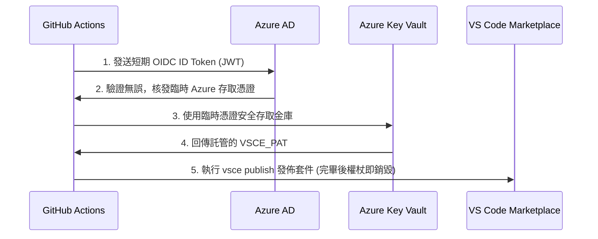

# VS Code Marketplace 套件發佈與 CI/CD 指南

本指南詳細說明如何將 **`code-gremlins-detector` (程式碼除妖鏡)** 套件發佈到官方 Visual Studio Code Marketplace，並介紹如何透過 **GitHub Actions** 與 **OIDC (OpenID Connect)** 實現安全的自動化發佈工作流。

---

## 1. 申請與建立發行商 (Publisher)

在發佈任何 VS Code 套件之前，您需要擁有一個 Marketplace 發行商帳號。

1. 登入 [Visual Studio Marketplace 管理主控台](https://marketplace.visualstudio.com/manage)。
2. 使用您的 Microsoft 帳戶登入。
3. 如果您尚未建立發行商，請點選 **Create Publisher**：
   * **Publisher ID**: 必須設定為 `doggy8088`（需與 `package.json` 中的 `publisher` 欄位一致）。
   * **Name**: 您的公開發行商名稱（例如：`Will 保哥`）。

---

## 2. 建立個人存取權杖 (PAT)

VS Code 發佈工具 (`vsce`) 仰賴 Azure DevOps 產生的 **Personal Access Token (PAT)** 來進行驗證。

1. 登入 [Azure DevOps 組織主控台](https://aex.dev.azure.com/)。
2. 在右上角的使用者設定選單中，點選 **Personal Access Tokens**。
3. 點選 **New Token**：
   * **Name**: 建議命名為 `VSCE Publish Token`。
   * **Organization**: 必須點選選單，選擇 **All accessible organizations** (關鍵步驟！)。
   * **Expiration**: 設定權杖到期時間（例如 90 天或更短）。
   * **Scopes**: 點選下方的 **Show all scopes**，找到並勾選 **Marketplace (publish)**（或在舊介面勾選 `Marketplace` 下的 `Publish` 權限）。
4. 點選 **Create**，並將產生出來的權杖複製儲存起來（關閉視窗後將無法再次檢視）。

---

## 3. GitHub Actions 自動化發佈配置

我們已在專案中建立好自動化 CI/CD 發佈腳本 [publish.yml](file:///Users/will/projects/vscode-gremlins/.github/workflows/publish.yml)。
當您在 Git 推送帶有版本號的 Tag（例如 `v0.26.0`）時，系統會自動執行測試、驗證代碼，並將套件上架至 Marketplace。

### A. 使用標準 GitHub Secrets 儲存 PAT (一般安全級別)
這是目前最普遍且簡便的發佈設定：

1. 進入您的 GitHub 專案倉庫（Repository）。
2. 前往 **Settings > Secrets and variables > Actions**。
3. 點選 **New repository secret**：
   * **Name**: `VSCE_PAT`
   * **Value**: 貼上剛剛複製的 Azure DevOps PAT 權杖。

---

## 4. 進階：透過 OIDC (OpenID Connect) 實現無密鑰安全發佈

### 為什麼要使用 OIDC？
直接將長期有效的 PAT 儲存在 GitHub Secrets 中存在一定的安全風險。**OIDC (OpenID Connect / 信任發佈)** 允許 GitHub Actions 透過暫時性的身份權杖，向雲端供應商（例如 Azure、AWS 或 HashiCorp Vault）安全地交換臨時憑證，從而**動態取得 PAT 或使用託管憑證發佈**。

雖然 VS Code Marketplace 的發佈 CLI (`vsce`) 目前不支援原生直接 OIDC 登入，但我們可以透過 **GitHub OIDC + 雲端秘密金庫 (Cloud Key Vault)** 的架構，在執行發佈時「即時、動態」地取得權杖，而在 GitHub 中不儲存任何明文金鑰：



### OIDC 整合步驟 (以 Azure Key Vault 為例)

#### 步驟 1：在 Azure 建立託管識別與應用程式註冊
1. 在 Azure Portal 建立一個 **應用程式註冊 (App Registration)**。
2. 進入該應用，點選 **Certificates & secrets > Federated credentials**（盟聯憑證）。
3. 新增一個憑證：
   * **Credential scenario**: GitHub Actions triggering workflow.
   * **Organization**: 您的 GitHub 帳號或組織（如 `doggy8088`）。
   * **Repository**: `vscode-gremlins`。
   * **Entity type**: Environment (推薦) 或 Branch/Tag。

#### 步驟 2：將 PAT 存放於 Azure Key Vault
1. 建立一個 **Azure Key Vault** (例如 `doggy8088KeyVault`)。
2. 在 **Secrets** 中新增一個秘密：
   * **Name**: `VSCE-PAT`
   * **Value**: 填入您的 Azure DevOps PAT 權杖。
3. 在 Key Vault 的 Access Policies 或 Azure RBAC 中，授權給剛才建立的應用程式註冊（App Registration）具備該 Secret 的 `Get` 讀取權限。

#### 步驟 3：在 GitHub 設定 OIDC 環境變數
在 GitHub 倉庫的 Secrets 中僅需儲存基本的雲端識別 ID（這些非敏感明文）：
* `AZURE_CLIENT_ID`: 應用程式註冊的用戶端 ID。
* `AZURE_TENANT_ID`: 您的 Azure 租戶 ID。
* `AZURE_SUBSCRIPTION_ID`: 您的 Azure 訂閱 ID。

#### 步驟 4：啟用 OIDC 工作流
打開專案中的 [.github/workflows/publish.yml](file:///Users/will/projects/vscode-gremlins/.github/workflows/publish.yml)，解除註釋 **OIDC 整合安全發佈方案範例** 區塊，並將最後發佈步驟的 `VSCE_PAT` 修改為從金庫輸出的變數即可。

---

## 5. 手動發佈方法 (本機電腦發佈)

若您想在自己的開發電腦上進行發佈，請確保全域安裝了 `vsce`：

```bash
# 全域安裝官方發佈工具
npm install -g @vscode/vsce

# 登入您的發行商 (會提示您輸入 PAT)
vsce login doggy8088

# 封裝與發佈套件
vsce publish
```

在發佈前，您也可以使用以下指令，預先打包成 `.vsix` 檔案以進行本機端手動測試：

```bash
# 打包套件產生 .vsix 檔案
vsce package
```
